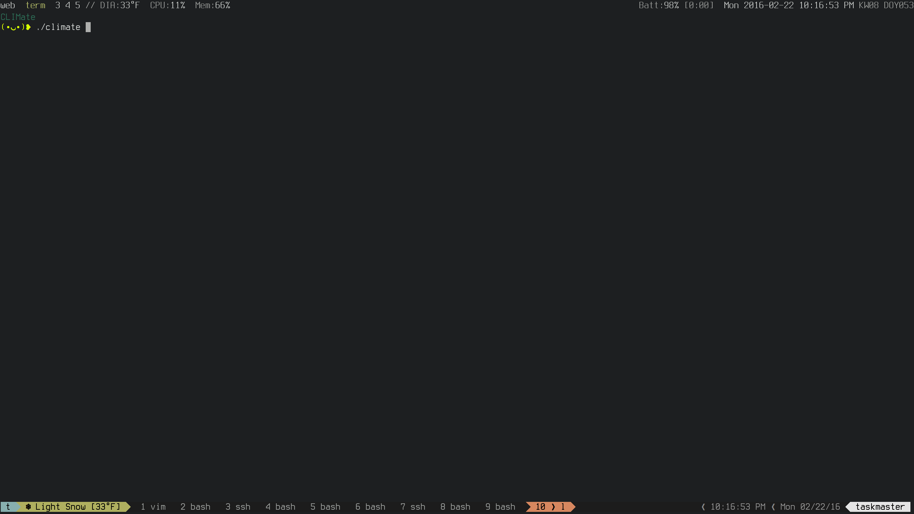

CLImate
===

Shows current radar images in the terminal



Configuration
---

Utilizes the WeatherUnderground API. Expects a simple config file at
`$HOME/.config/climate.conf`:

```
[general]
latitude: 55.555
longitude: -155.55
api_key: wundergroup-api-key
# optional, field of view for radar
radius: 5
```

Requirements
---

* Python 2
* Imagemagick or GraphicsMagick
